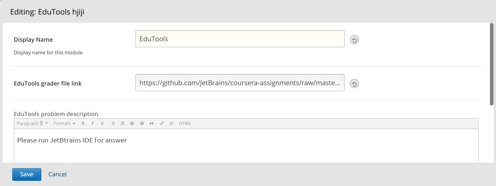
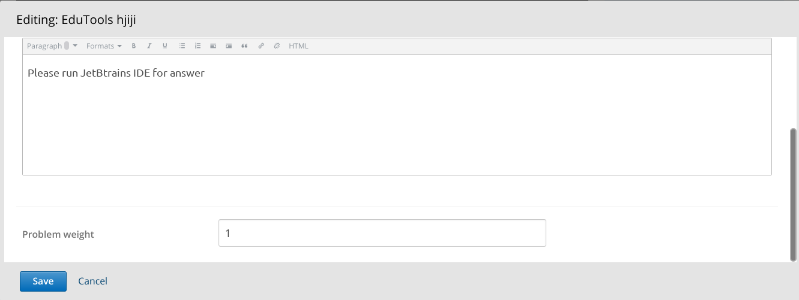

# xblock-edutools
XBlock for integration with JetBrains EduTools plugin

## Installation
```shell
sudo -sHu edxapp
source ~/edxapp_env
pip install -e "git+https://github.com/raccoongang/xblock-edutools.git#egg=xblock_edutools"
```

## Enabling in Studio

You can enable the EduTools xblock in studio through the advanced
settings:

1. From the main page of a specific course, click on *Settings*,
   *Advanced Settings* in the top menu.
2. Check for the *Advanced Module List* policy key, and add
   `"edutools"` in the policy value list.
    ```json
    [
        ...
        "edutools",
        ...
    ]
    ```
3. Click on the *Save changes* button.


## Usage

    
    

1. "EduTools grader file link" - link to zip file for IDE
2. "EduTools problem description" - Description of problem
3. "Problem weight" - maximum score that a student can score after passing this block
